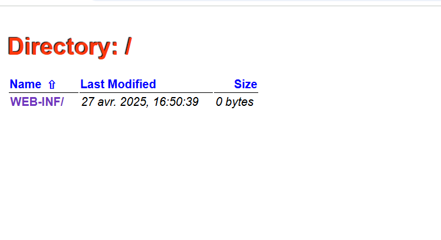
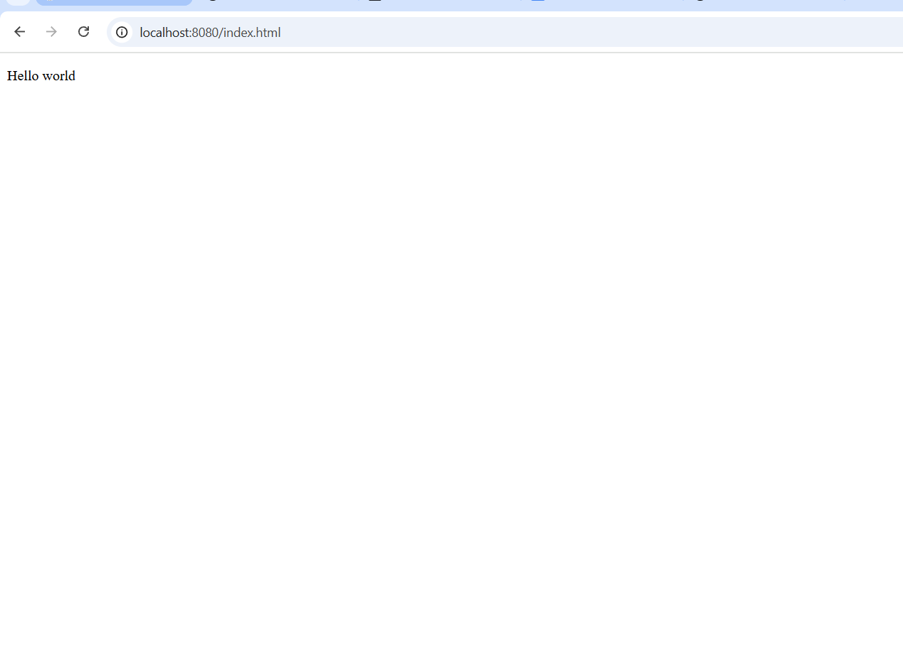
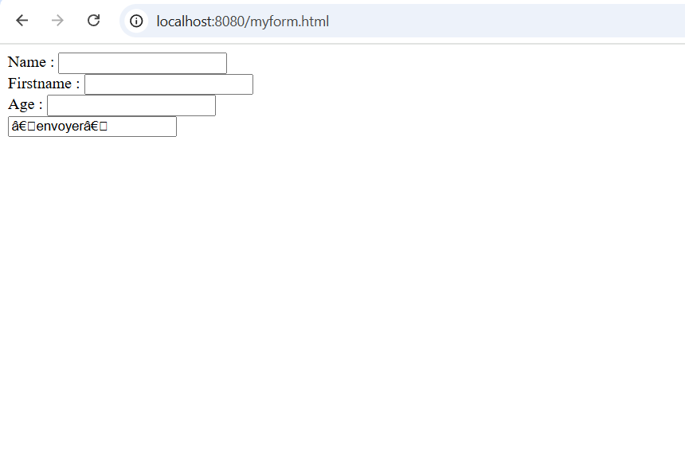

# Partie 1 Servlet
    1) Tout d’abord, modifiez votre fichier pom.xml. 
        Changez le type de packaging vers un packaging de type war pour les applications webs
    2) Ajoutez une dépendance à l’API des servlets toujours dans le pom.xml
     ```
        <dependency>
            <groupId>jakarta.servlet</groupId>
            <artifactId>jakarta.servlet-api</artifactId>
            <version>5.0.0</version>
            <scope>provided</scope>
        </dependency>
     ```
    Note: Vous noterez le scope qui est placé à provided ce qui veut dire que cette librairie sera fournie par le conteneur d’application et ne doit pas être embarquée au sein de l’application Web. 

    3) Ajoutez enfin dans les plugins de build, celui de jetty qui permet de démarrer jetty depuis maven. 
       Toujours dans le fichier pom.xml juste en bas du bloc <dependencies></dependencies>
          ```
             <plugin>
				<!-- https://mvnrepository.com/artifact/org.eclipse.jetty/jetty-maven-plugin -->
				<groupId>org.eclipse.jetty</groupId>
				<artifactId>jetty-maven-plugin</artifactId>
				<version>11.0.16</version>
				<configuration>
					<webApp>
						<contextPath>/</contextPath>
					</webApp>
					<httpConnector>
						<port>8080</port>
					</httpConnector>
				</configuration>
			</plugin>
          ```
        Ce plugin la sera dans le block build suivant : 
            ```
                <build>
                    <plugins>
                        <plugin>
                            <!-- Ton plugin ici -->
                        </plugin>
                    </plugins>
                </build> 
           ```
            Note: le plugin jetty permet de deployer notre application au lancement 
        4) Deployons notre application en localhost//8080 en developpement
                En lancant le run a la manière jetty qui est la suivante : 
              Voici comment faire pour lancer compile jetty:run dans IntelliJ :

           1. Ouvre ton projet dans IntelliJ.
           2. Ouvre l'onglet Maven (généralement à droite de l'écran ou via View -> Tool Windows -> Maven).
           3. Clique sur ton projet Maven dans l'onglet Maven.
           4. Clique sur "Lifecycle" :
              Double-clique sur compile pour compiler le projet.
        
           5. Ensuite clique sur "Plugins" :
              Déplie la section jetty.
        
        Là tu verras la commande jetty:run.
        
        Clique double sur jetty:run → ça va lancer ton serveur Jetty et déployer ton application directement.

## Notre run s'execute, mais on obtient le message suivant : [INFO] Automatic redeployment disabled, see 'mvn jetty:help' for more redeployment options
    Signifie-t-il que le déployement a échoué ? 
     
    Non le déployement n'a pas échoué quand on va sur notre serveur local : à l'adresse http://localhost:8080/ on obtient la page suivante: 
        

    Mais que signifie ce message alors ? 
        Ça veut juste dire que Jetty n’a pas activé la fonctionnalité d’auto-rechargement automatique.( # hot reload )

# Question 2. Insertion de ressources statiques


Créer un répertoire src/main/webapp.


Ajoutez-y un fichier index.html contenant Hello world.

Relancez jetty.
http://localhost:8080/index.html


Vous devriez voir votre page web. L’ensemble des ressources statiques (html files, javascript file, images) de votre projet doivent se trouver dans le répertoire src/main/webapp.


Resultat :


# Question 3.  Création de votre première Servlet
        Créer une classe  qui étend HttpServlet. Surchargez les méthodes doGet et doPost qui seront appelées lors de la réception d’un GET et d’un POST sur l’url “/myurl”.


```
        package servlet;
        
        import java.io.IOException;
        import java.io.PrintWriter;
        
        import jakarta.servlet.ServletException;
        import jakarta.servlet.annotation.WebServlet;
        import jakarta.servlet.http.HttpServlet;
        import jakarta.servlet.http.HttpServletRequest;
        import jakarta.servlet.http.HttpServletResponse;
        
        @WebServlet(name="mytest",
        urlPatterns={"/myurl"})
        public class MyServlet extends HttpServlet {
        
            @Override
            protected void doGet(HttpServletRequest req, HttpServletResponse resp)
                    throws ServletException, IOException {
                    
                PrintWriter p = new PrintWriter(resp.getOutputStream());
                p.print("Hello world");
                p.flush();
                
            }
        
            @Override
            protected void doPost(HttpServletRequest req, HttpServletResponse resp)
                    throws ServletException, IOException {
                // TODO Auto-generated method stub
                super.doPost(req, resp);
            }	
        }

```
> Note: pour le moment je ne sais pas mais je pense que à un moment, il faudra donner une valeur précise à myurl
Et moi pour des raisons d'organisations j'ai décidé de crééer un package servlets pour mettre  cette nouvelle classe dedans

# Question 4. Création de votre première Servlet qui consomme les données d’un formulaire.Question 4. Création de votre première Servlet qui consomme les données d’un formulaire.

     Créer un fichier myform.html dans le paquet webapp et placez y le code suivant. 
      ```
        <html>
            <body>
            <FORM Method="POST" Action="/UserInfo">
            Name : 		<INPUT type="text" size="20" name="name"><BR>
            Firstname : 	<INPUT type="text" size=”20” name=’firstname’><BR>
            Age : 		<INPUT type=”text” size=”2” name=’age’><BR>
                    <INPUT type=”submit” value=”Send”>
            </FORM>
            </body>
        </html>
      ```
     Puis créer une classe Java UserInfo toujours dans le paquet servlet avec le code suivant: 
       ```
          package servlet;
        import java.io.IOException;
        import java.io.PrintWriter;
        
        import jakarta.servlet.ServletException;
        import jakarta.servlet.annotation.WebServlet;
        import jakarta.servlet.http.HttpServlet;
        import jakarta.servlet.http.HttpServletRequest;
        import jakarta.servlet.http.HttpServletResponse;
        
        @WebServlet(name="userinfo",
        urlPatterns={"/UserInfo"})
        public class UserInfo extends HttpServlet {
        public void doPost(HttpServletRequest request,
        HttpServletResponse response)
        throws ServletException, IOException {
        response.setContentType("text/html");

	PrintWriter out = response.getWriter();

	
	out.println("<HTML>\n<BODY>\n" +
				"<H1>Recapitulatif des informations</H1>\n" +
				"<UL>\n" +			
		" <LI>Nom: "
				+ request.getParameter("name") + "\n" +
				" <LI>Prenom: "
				+ request.getParameter("firstname") + "\n" +
				" <LI>Age: "
				+ request.getParameter("age") + "\n" +
				"</UL>\n" +				
		"</BODY></HTML>");
        }
        }
    ```
    Stopper , puis relancer jetty ensuite tester l'application sur le lien suivant : 
     Testez votre application en vous rendant ici
        http://localhost:8080/myform.html

    Resultat :
     
    Parcourez ensuite les exemples suivants. 
https://www.tutorialspoint.com/servlets/servlets-first-example.htm
 
# Action retenues de ce support : 
En fait ce support explique comment créer un servlet en java.
 En global c'est juste un classe qui hérite de httpServlet et qui implémente la méthode doGet et aussi doPost...

Et donc cela correspond donc aux classes que nous avons créé "MyServlet" et "UserInfo"

>Note: Ici tout ce que ce support dit sur les classPath ne nous intéresse pas car nous on ne veux pas exécuter en cmd
    mais plutôt en ide qui fait déjà tout cela automatiquement. Mais pour ceux que ca intéresse Classpath est un paramètre passé à une machine virtuelle Java qui définit le chemin d'accès au répertoire où se trouvent les classes et les packages Java afin qu'elle les exécute.
Maintenant voyons voir comment déployer un servelet : 
D'après le tutoriel en ligne
>  By default, a servlet application is located at the path <Tomcat-installationdirectory>/webapps/ROOT, là nous ne somme pas sur TOMCAT mais essayons voir
> the class file would reside in <Tomcat-installationdirectory>/webapps/ROOT/WEB-INF/classes. 
    Ca veut dire qu'on doit rechercher ce meme chemin là dans notre projet et ensuite compiler nos servelets pour qu'ils aient l'extension .class avant de les ajouter à ce chemin là
> create following entries in web.xml file located in <Tomcat-installation-directory>/webapps/ROOT/WEB-INF/:
    Ca veut dire que ensuite nous allons créer notre entrée web.xml avec et y ajouter le contenu du tutoriel.
>You are almost done, now let us start tomcat server using <Tomcat-installationdirectory>\bin\startup.bat:
   Ca veut dire que si tu utilise un autre serveur a part TomCat il faut lancer ce serveur là, ( apprendre à personnaliser les instructions d'un tp )
voyons voir si le fichier webInf a été créé inductivement par notre serveur Jetty.
>Note : au final certes ya ce tutoriel que je viens de lire mais pour savoir comment tout faire avec jetty juste suivre la vidéo du prof. https://drive.google.com/file/d/1eler78gnkpVkBXOBJzmPhWHe_TJda2V5/preview
On a déjà un webapp que nous avons créé nous meme, alors nous avons les actions suivantes à faire selon le tutoriel : 
> Note : probablement le compile qu'on fait avant de lancer notre déploiement jetty correspond a la tranformation en notre fichier 
  .class, mentionnée dans le tutoriel précédent.

    
1) Compiling a Servlet: 
   


Ensuite :
# Question 5. Retour sur l’application de Gestion de RDV:

À partir de cette base, construisons une page web qui retourne des informations issues de la base de données et un formulaire qui permet d’ajouter des éléments dans la base de données.

>Note: je suis bloqué à la question 4 car je ne sais pas ce que son execution devrait faire et aussi comment appliquer le document lu  car par exemple le dossier serveletDevel dont il parle n'existait pas sur disque dur windows j'ai du le créer par moi meme 
>Note: en fait tout ce qui est servelet et rest , c'est le navigateur qui communique avec notre backend et envoyant et recevant des données
> 
Mercredi 30/04/2025 de 20h à 21h30 objectif faire fonctionner le servelet...
    


